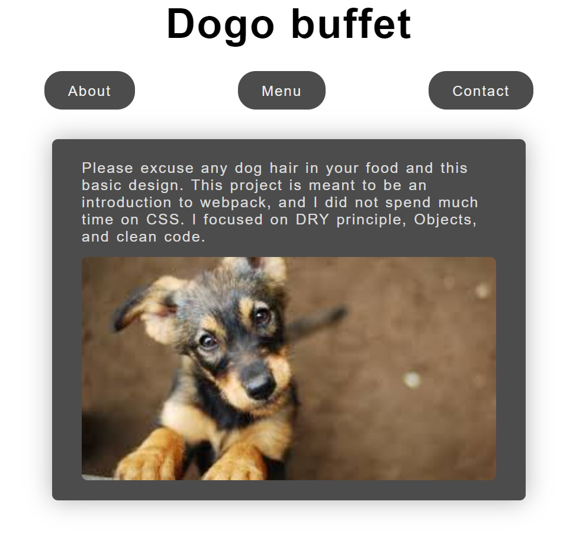

# Restaurant Page

#### Welcome to our Restaurant Page project.
#### The project has an about, menu and contact pages.

#### Features 
- webpack.
- Dry principle.
- Create every element on the DOM through JavaScript only.

#### Screenshot

#### Livedemo
- [github-pages](https://ceci007.github.io/restaurant-page/)

## Build with
- webpack

## Getting started
- run `git clone https://github.com/Ceci007/restaurant-page.git`;
- open `dist/index.html` with you favorite browser.

## Authors
👤 [Cecilia Benitez](https://ceciliabenitez.com/)

## Contributing

Contributions, issues and feature requests are welcome!

Feel free to check the [issues page](https://github.com/Ceci007/restaurant-page/issues)

## Show your support

Give a star if you like this project!

## 📝 License

This project is MIT licensed.